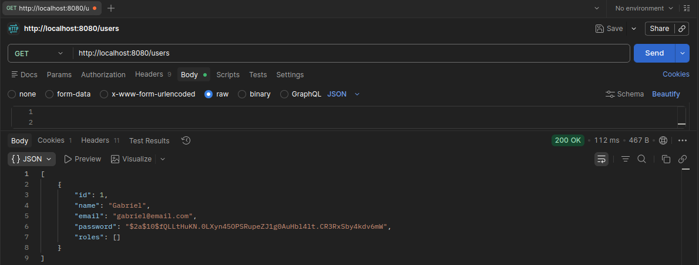
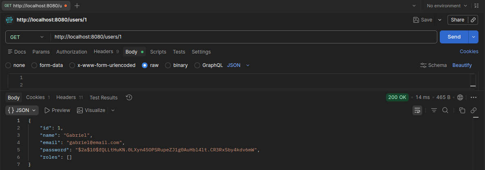
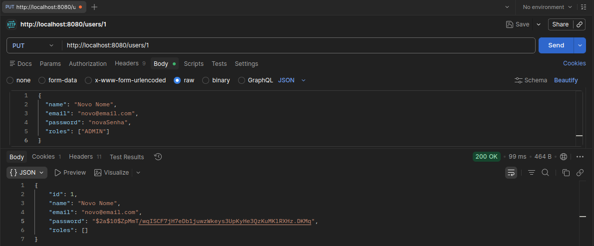
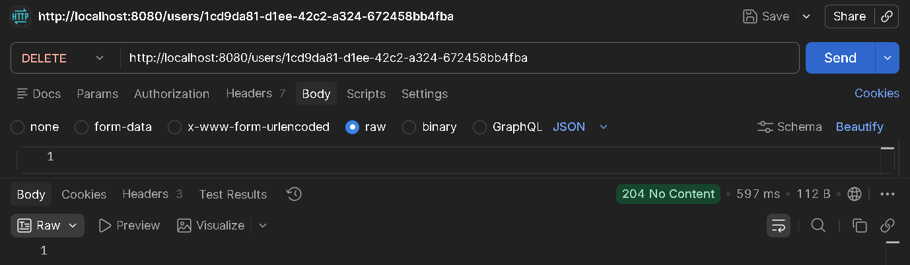
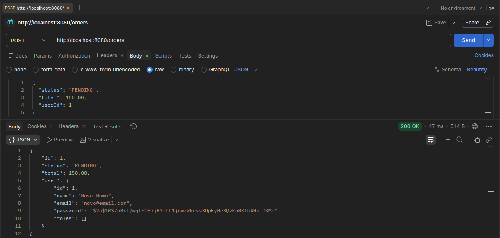
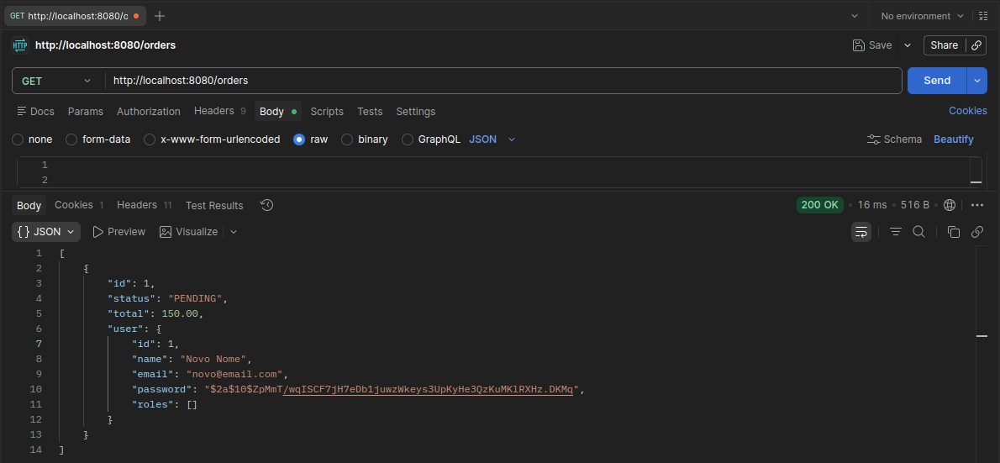
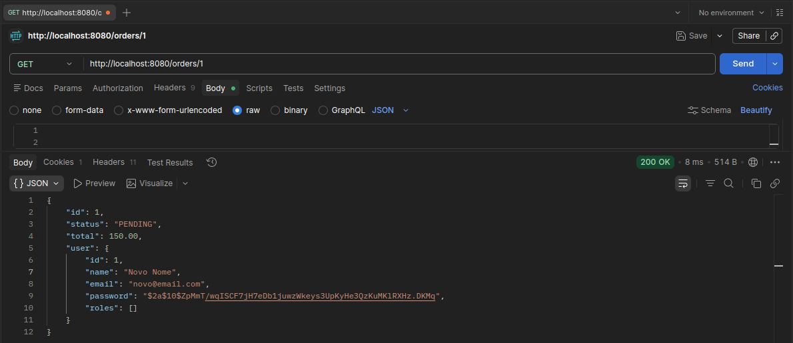
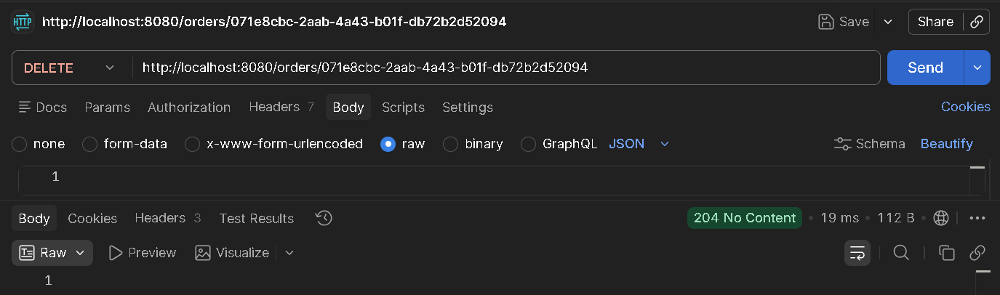
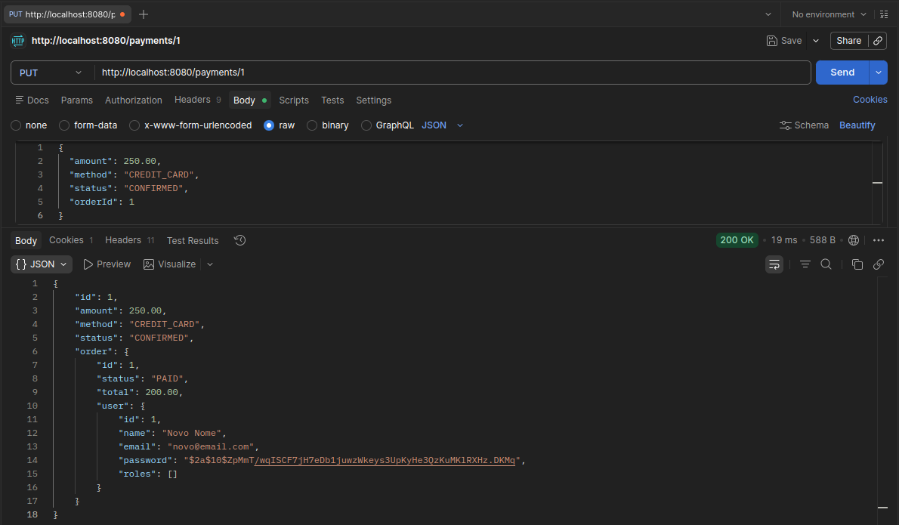
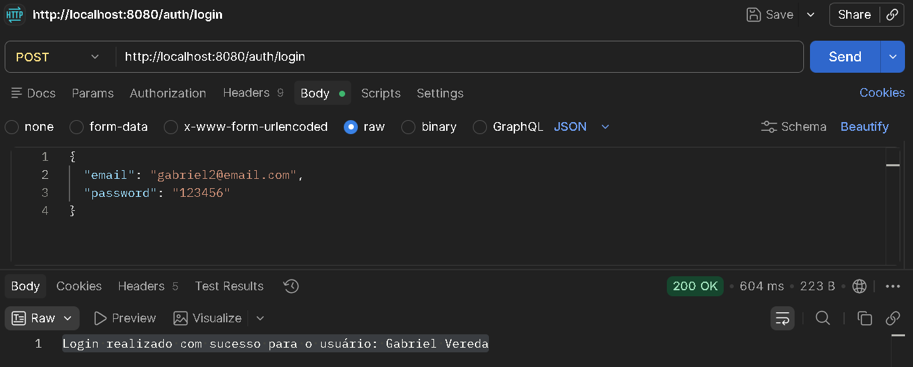

# 🛒 E-commerce API

API RESTful desenvolvida com **Spring Boot** para gerenciamento de um sistema de e-commerce.

Este projeto implementa um backend completo com operações CRUD, relacionamentos entre entidades e estrutura organizada seguindo boas práticas de desenvolvimento.

---

## ✨ Funcionalidades

* 👤 Gerenciamento de usuários (CRUD completo)
* 📦 Criação e controle de pedidos
* 💳 Registro de pagamentos
* 🔐 Criptografia de senhas com BCrypt
* 📑 Uso de DTOs para entrada/saída de dados
* 🗂️ Enums para status de pedidos e métodos de pagamento

---

## 🛠️ Tecnologias Utilizadas

* Java 17+
* Spring Boot
* Spring Data JPA
* Hibernate
* Lombok
* MySQL
* Maven
* Postman

---

## 📂 Estrutura do Projeto
```
com.projeto.ecommerce
    ├── controllers
    ├── DTOs
    ├── entities
    ├── enums
    ├── repositories
    ├── services
    └── security
```

---

## 🌐 Base URL

**Local**
http://localhost:8080/

---

# 🔑 Endpoints da API (Local)

---

## 👤 Usuários (`/users`)

### Criar usuário
**POST** `/users`

`json`
```
{
  "name": "Gabriel",
  "email": "gabriel@email.com",
  "password": "123456",
  "roles": "USER"
}
```


### Listar usuários
**GET** `/users`


### Buscar por ID
**GET** `/users/{id_user}`


### Atualizar usuário
**PUT** `/users/{id_user}`

`json`
```
{
  "name": "Novo Nome",
  "email": "novo@email.com",
  "password": "novaSenha",
  "roles": "ADMIN"
}
```


### Deletar usuário
**DELETE** `/users/{id_user}`


## 📦 Pedidos (`/orders`)
### Criar pedido
**POST** `/orders`

`json`
```
{
  "status": "AWAITING_PAYMENT",
  "total": 150.00,
  "clientId": "id_user"
}
```


### Listar pedidos
**GET** `/orders`


### Buscar por ID
**GET** /`orders/{id_order}`


### Atualizar pedido
**PUT** `/orders/{id_order}`

`json`
```
{
  "status": "PAID",
  "total": 200.00,
  "clientId": "id_user"
}
```


### Deletar pedido
**DELETE** `/orders/{id_order}`


## 💳 Pagamentos (`/payments`)
### Criar pagamento
**POST** `/payments`

`json`
```
{
  "amount": 200.00,
  "method": "PIX",
  "status": "CONFIRMED",
  "orderId": "id_order"
}
```


### Listar pagamentos
**GET** `/payments`


### Buscar por ID
**GET** `/payments/{id_payment}`


### Atualizar pagamento
**PUT** `/payments/{id_payment}`

`json`
```
{
  "amount": 250.00,
  "method": "CREDIT_CARD",
  "status": "CONFIRMED",
  "orderId": "id_order"
}
```


### Deletar pagamento
**DELETE** `/payments/{id_payment}`


## 🔐 Autenticação (`/auth`)
### Login
**POST** `/auth/login`

`json`
```
{
  "email": "gabriel@email.com",
  "password": "123456"
}
```


## 📊 Modelo de Dados
- Um usuário possui vários pedidos
- Um pedido possui um pagamento
- Status de pedidos controlados via OrderStatus (enum)
- Métodos de pagamento controlados via PaymentMethod (enum)
- Perfis de acesso controlados via RoleEnum (ADMIN / USER)

## 🚀 Como Rodar o Projeto
### Clonar repositório
```
git clone https://github.com/BielVereda/Ecommerce_Aula_BackEnd.git
```

### Entrar na pasta
```
cd ecommerce
```

### Executar aplicação
```
./mvnw spring-boot:run
```

## 🧪 Testes
### Você pode **testar os endpoints** utilizando:
- Postman
- Insomnia

## 🔮 Melhorias Futuras
- Autenticação com JWT
- Implementação de OrderItem (carrinho real)
- Documentação com Swagger
- Tratamento global de exceções
- Paginação de dados
- Deploy em serviços cloud (Render / Railway / AWS)

## 👨‍💻 Autor
Desenvolvido por **BielVereda**

## 📌 Considerações Finais
Este projeto foi desenvolvido com foco em aprendizado e boas práticas no desenvolvimento de APIs REST com Spring Boot.

Sinta-se livre para contribuir, melhorar ou utilizar como base para projetos maiores 🚀