# 🛒 E-commerce API

API RESTful desenvolvida com **Spring Boot** para gerenciamento de um sistema de e-commerce.

Este projeto implementa um backend completo com operações CRUD, relacionamentos entre entidades e estrutura organizada seguindo boas práticas de desenvolvimento.

---

## 🚀 Funcionalidades

* 👤 Gerenciamento de usuários
* 📦 Gerenciamento de produtos
* 🏷️ Categorias de produtos
* 🧾 Criação e controle de pedidos
* 💳 Registro de pagamentos
* 🔐 Controle de perfis (ADMIN / USER)
* 🔄 CRUD completo (Create, Read, Update, Delete)

---

## 🧱 Tecnologias Utilizadas

* Java 17+
* Spring Boot
* Spring Data JPA
* Hibernate
* Lombok
* H2 / PostgreSQL
* Maven
* Postman

---

## 📂 Estrutura do Projeto

```
com.projeto.ecommerce
  ├── controllers
  ├── DTOs
  ├── entities
  ├── enums
  ├── repositories
  └── services
  
```

---

## 🌐 Base URL

**Local**
```
http://localhost:8080/
```

---
**API**
```
https://ecommercevereda.azurewebsites.net/
```
**Teste API:**


---

# 🔎 Endpoints da API (Local)

---

## 👤 Usuários (`/users`)

### 📌 Criar usuário

**POST** `/users`

```json
{
  "name": "Gabriel",
  "email": "gabriel@email.com",
  "phone": "19999999999",
  "password": "123456",
  "roles": "USER"
}
```
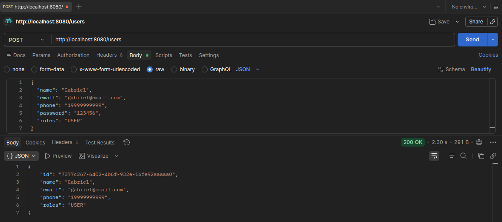

---

### 📌 Listar usuários

**GET** `/users`
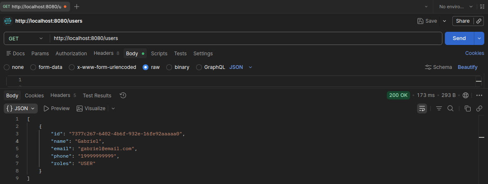
---

### 📌 Atualizar usuário

**PUT** `/users/{id}`

```json
{
  "name": "Novo Nome",
  "email": "novo@email.com",
  "phone": "111111111",
  "roles": "ADMIN"
}
```
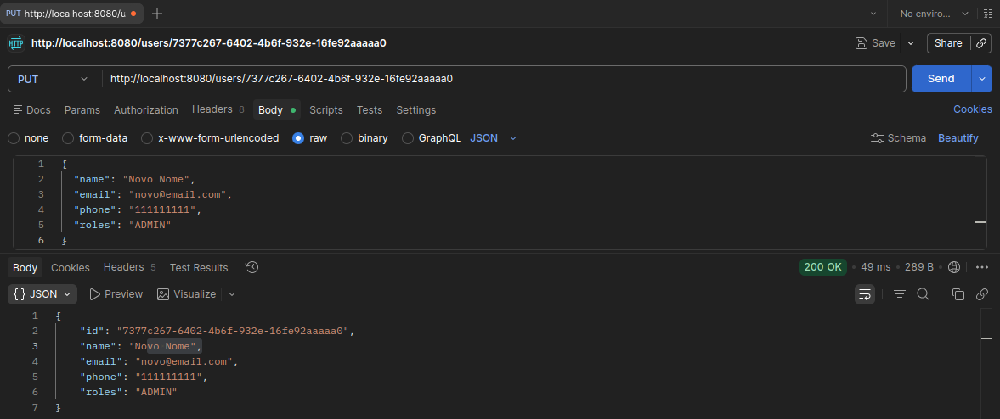
---

### 📌 Deletar usuário

**DELETE** `/users/{id}`
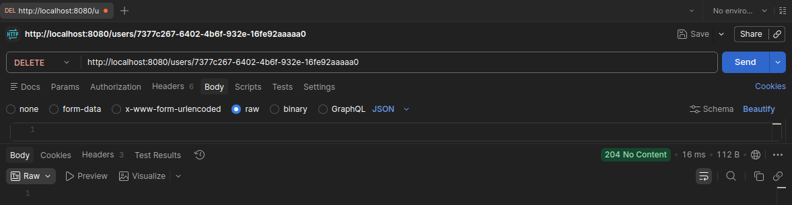
---

## 📦 Produtos (`/products`)

### 📌 Criar produto

**POST** `/products`

```json
{
  "name": "Notebook Gamer",
  "description": "RTX 4060, 16GB RAM",
  "price": 7500,
  "imgURL": "https://imagem.com/notebook.jpg",
  "categoriesIds": ["uuid-da-categoria"]
}
```
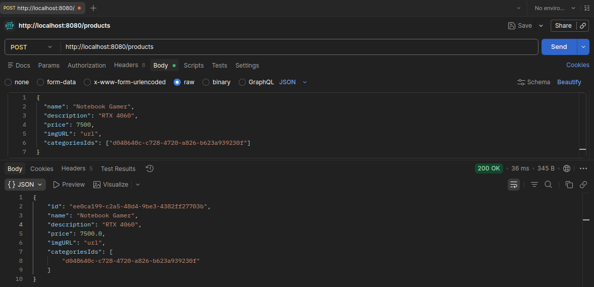
---

### 📌 Listar produtos

**GET** `/products`
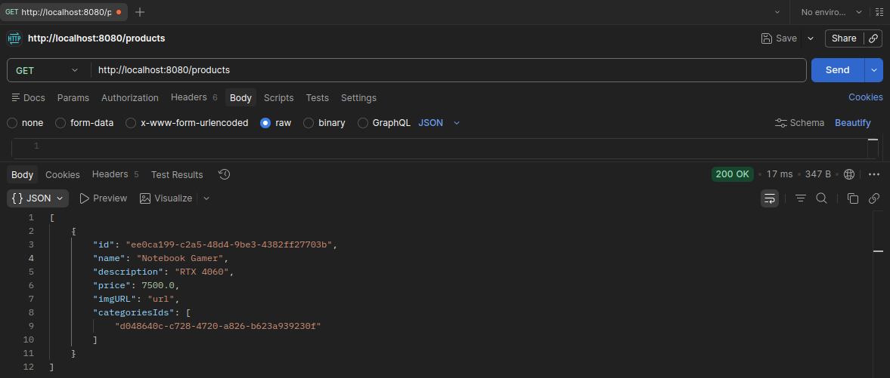
---

### 📌 Buscar por ID

**GET** `/products/{id}`
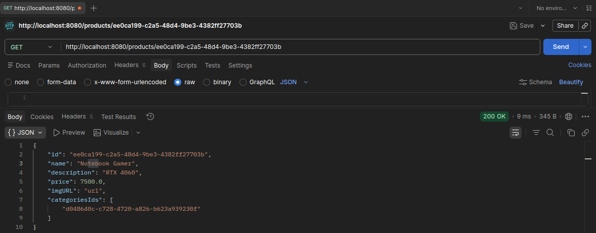
---

### 📌 Atualizar produto

**PUT** `/products/{id}`

```json
{
  "name": "Produto Atualizado",
  "description": "Nova descrição",
  "price": 999.99,
  "imgURL": "url",
  "categoriesIds": []
}
```
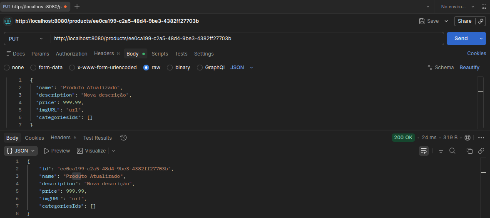
---

### 📌 Deletar produto

**DELETE** `/products/{id}`
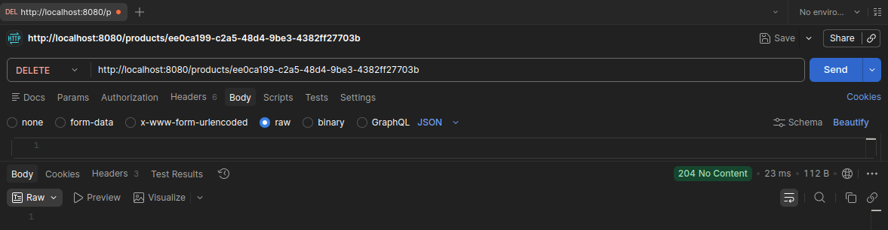
---

## 🏷️ Categorias (`/categories`)

### 📌 Criar categoria

**POST** `/categories`

```json
{
  "name": "Eletrônicos"
}
```
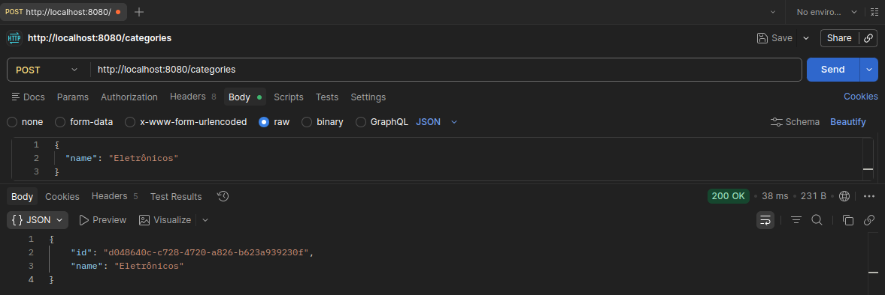
---

### 📌 Listar categorias

**GET** `/categories`
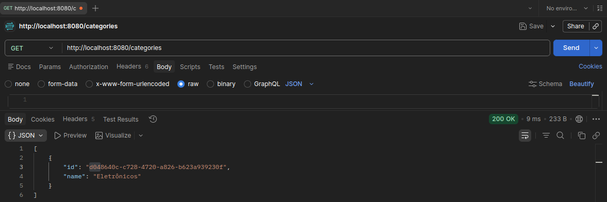
---

### 📌 Buscar por ID

**GET** `/categories/{id}`
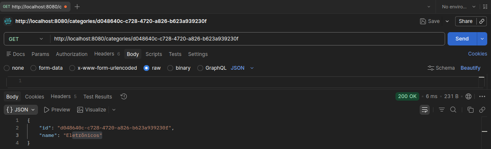
---

### 📌 Atualizar categoria

**PUT** `/categories/{id}`

```json
{
  "name": "Nova Categoria"
}
```
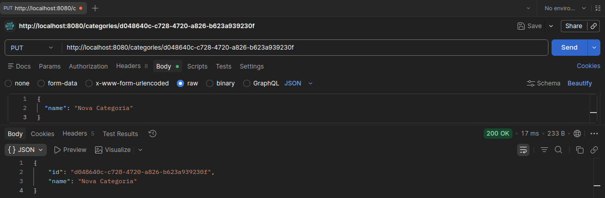
---

### 📌 Deletar categoria

**DELETE** `/categories/{id}`

---

## 🧾 Pedidos (`/orders`)

### 📌 Criar pedido

**POST** `/orders`

```json
{
  "status": "AWAITING_PAYMENT",
  "clientId": "uuid-do-usuario"
}
```
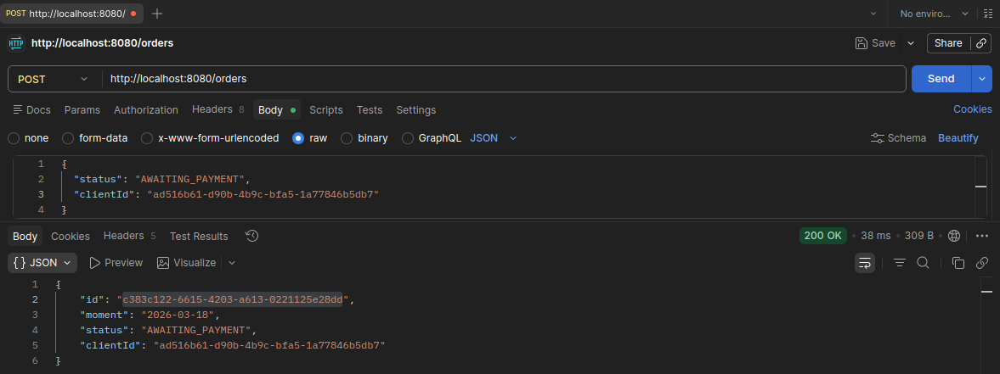
---

### 📌 Listar pedidos

**GET** `/orders`
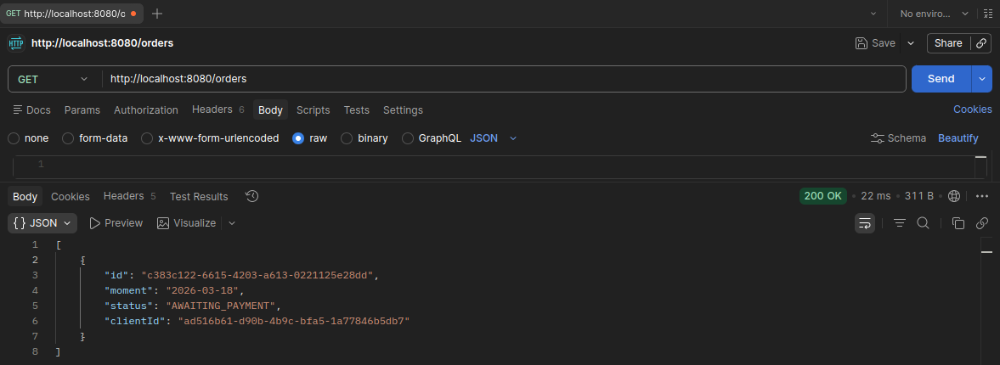
---

### 📌 Buscar por ID

**GET** `/orders/{id}`
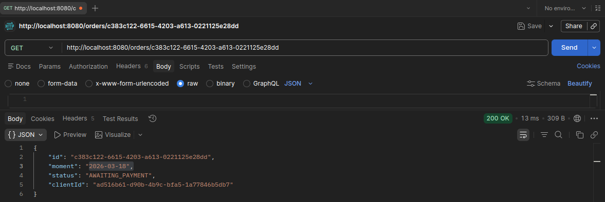
---

### 📌 Atualizar pedido

**PUT** `/orders/{id}`

```json
{
  "status": "PAID",
  "clientId": "uuid-do-usuario"
}
```
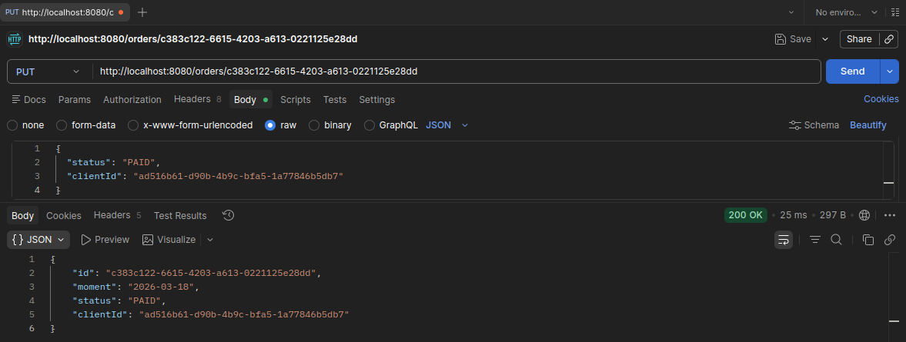
---

### 📌 Deletar pedido

**DELETE** `/orders/{id}`

---

## 💳 Pagamentos (`/payments`)

### 📌 Criar pagamento

**POST** `/payments`

```json
{
  "orderId": "uuid-do-pedido"
}
```
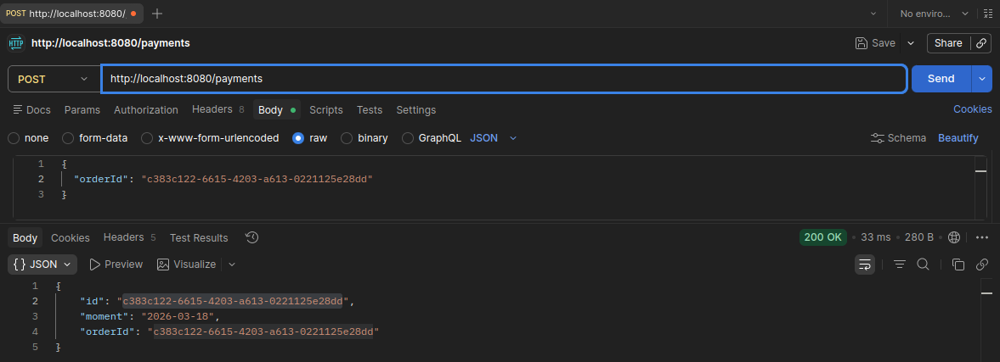
---

### 📌 Listar pagamentos

**GET** `/payments`
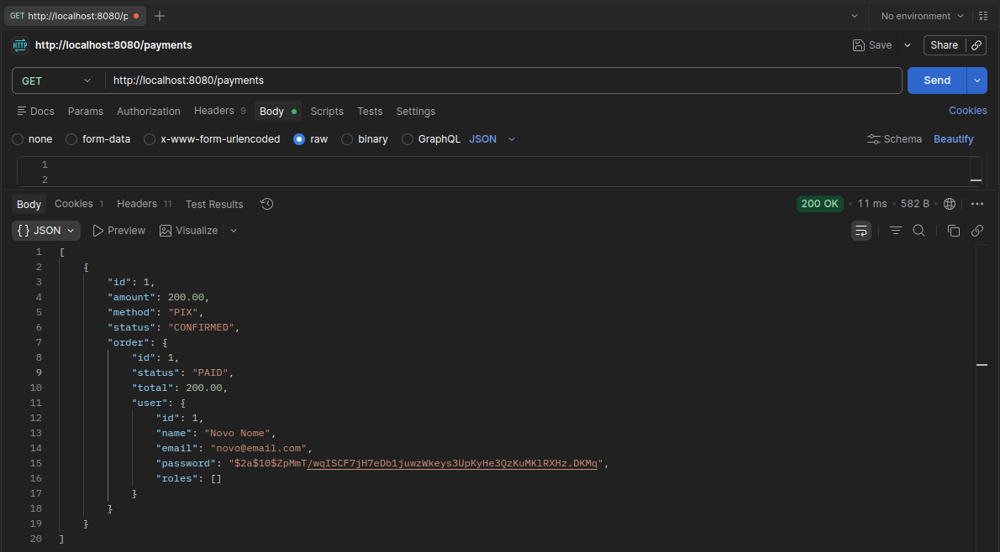
---

### 📌 Buscar por ID

**GET** `/payments/{id}`
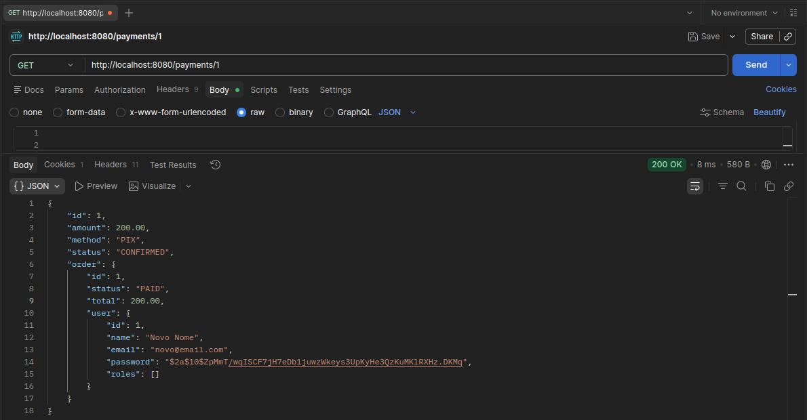
---

### 📌 Atualizar pagamento

**PUT** `/payments/{id}`

```json
{
  "moment": "2026-03-18"
}
```
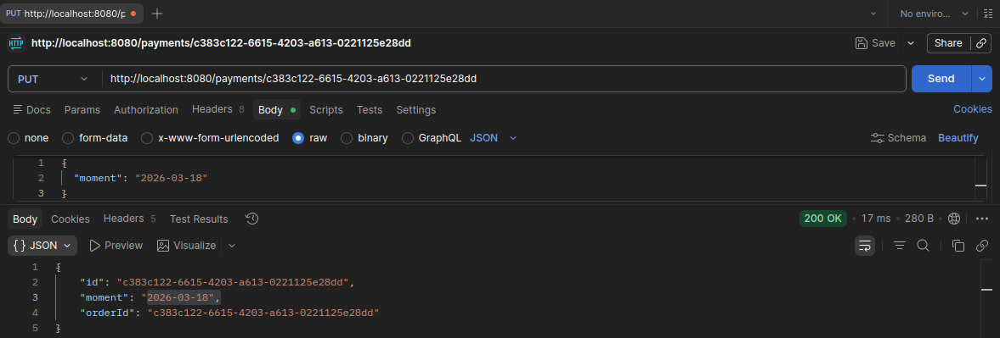
---

### 📌 Deletar pagamento

**DELETE** `/payments/{id}`
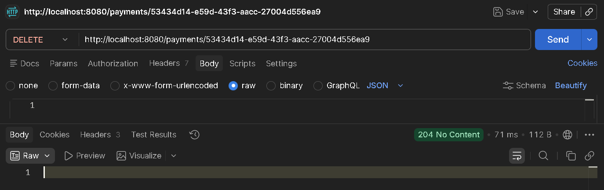
---

## 🗄️ Modelo de Dados

### Principais relacionamentos:

* Um usuário possui vários pedidos
* Um pedido possui um pagamento
* Um produto pode ter várias categorias
* Relação Many-to-Many entre Produto e Categoria

---

## ▶️ Como Rodar o Projeto

### 📌 Clonar repositório

```
git clone https://github.com/BielVereda/Ecommerce_Aula_BackEnd.git
```

### 📌 Entrar na pasta

```
cd ecommerce
```

### 📌 Executar aplicação

```
./mvnw spring-boot:run
```

---

## 🧪 Testes

Você pode testar os endpoints utilizando:

* Postman
* Insomnia

---

## 🧠 Melhorias Futuras

* 🔐 Autenticação com JWT
* 📦 Implementação de OrderItem (carrinho real)
* 📄 Documentação com Swagger
* ⚠️ Tratamento global de exceções
* 📊 Paginação de dados
* 🌐 Deploy (Render / Railway / AWS)

---

## 👨‍💻 Autor

Desenvolvido por **BielVereda**

---

## ⭐ Considerações Finais

Este projeto foi desenvolvido com foco em aprendizado e boas práticas no desenvolvimento de APIs REST com Spring Boot.

Sinta-se livre para contribuir, melhorar ou utilizar como base para projetos maiores 🚀
